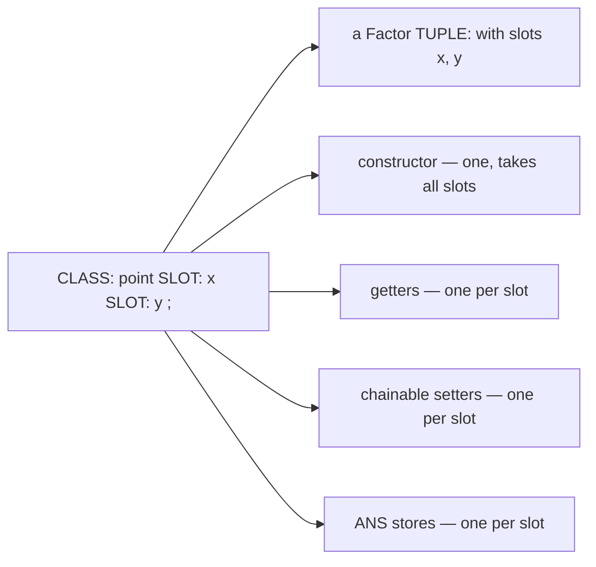
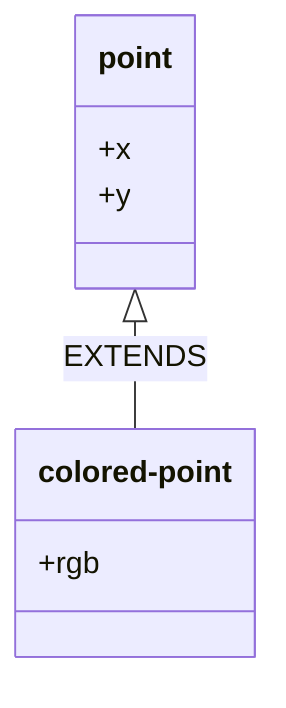

# Classes and methods

Factor4th gives you a CLOS-flavoured object system on top of ANS
Forth: record classes with named slots, generic functions, and
methods that dispatch on the class of their argument.  It maps
straight onto Factor's tuple+generic machinery, so you get
inline-cached dispatch and tag-erased polymorphic slots for free.

## Defining a class

```forth
CLASS: point
    SLOT: x
    SLOT: y
;
```

That gives you a new record type with two slots, plus a small
family of auto-generated words to construct and manipulate
instances.

### What you get per CLASS:

For `CLASS: point SLOT: x SLOT: y ;` the compiler generates:

| Word            | Stack effect       | What it does                                       |
|-----------------|--------------------|----------------------------------------------------|
| `<point>`       | `( x y -- p )`     | Constructor — builds a point with the given slots  |
| `point>x`       | `( p -- x )`       | Getter for the `x` slot                            |
| `point>y`       | `( p -- y )`       | Getter for the `y` slot                            |
| `x>>point`      | `( p v -- p )`     | Chainable setter — writes `v` to `x`, returns `p`  |
| `point.x!`      | `( v p -- )`       | ANS-flavoured store — writes `v` to `x`, drops `p` |
| `y>>point`      | `( p v -- p )`     | Chainable setter for `y`                           |
| `point.y!`      | `( v p -- )`       | ANS store for `y`                                  |

The class name itself (`point`) is also reserved so `METHOD:`
declarations can dispatch on it.

One `CLASS:` line desugars into a Factor `TUPLE:` plus the full
family of words — you write the declaration, the compiler writes
the boilerplate:



## Constructing instances

The constructor `<classname>` takes one item per slot in
declaration order — leftmost slot at the bottom of the stack,
rightmost on top:

```forth
3 4 <point>           \ x=3, y=4

\ Slots are polymorphic — any Factor-taggable value goes in:
3.14e 2.71e <point>   \ x=float, y=float
s$" hi" 42 <point>    \ x=managed-string, y=int
```

This is the same tag-erasure that makes `VALUE` polymorphic.  A
slot doesn't know or care what type it holds; Factor's tagged
pointers do the bookkeeping.

## Reading slots

The getter `class>slot` is straight from the textbook:

```forth
3 4 <point>
dup point>x .         \ 3
point>y .             \ 4
```

It consumes the object.  Use `dup` first if you want to keep
the instance after reading a slot.

## Writing slots — two flavours

Factor4th ships **two setters per slot** because they're
different operations in idiom, even though they touch the same
field.

### `slot>>class` — chainable, returns the object

Stack effect: `( p v -- p )`.  The object stays on the stack
with the slot updated.  Use this for fluent construction or
when you want to thread the same instance through several
writes:

```forth
0 0 <point>           \ start blank
3 x>>point            \ ( p -- p' ) x=3
4 y>>point            \ ( p -- p' ) y=4
\ Same end state as `3 4 <point>` but you can interleave logic
```

```forth
\ Update one field of an existing point:
mypoint 99 x>>point   \ ( -- mypoint' ) with x=99
```

Reads "value flows into slot of class."  Matches Factor's
native `>>x` convention exactly; we just namespace it so
`x>>point` and `x>>vector3` don't collide.

### `class.slot!` — ANS-style store, drops the object

Stack effect: `( v p -- )`.  The object goes away.  Use this
when you're mutating in place and just want the field set:

```forth
99 mypoint point.x!   \ matches `99 var !` muscle memory
3.14e mypoint point.y!
```

Reads "value, into class's slot, store."  Both setters
ultimately call Factor's `>>x` on the same tuple slot; the
difference is purely stack discipline.

### Which to use?

  - **Building a new instance from a literal**: just use the
    constructor `<point>`.
  - **Setting one or two fields on an existing instance and
    moving on**: ANS style, `99 p point.x!`.
  - **Pipelining multiple writes**: chainable, `p 1 x>>point
    2 y>>point 3 z>>point`.

The compiler inlines both — they're zero-cost abstractions over
the underlying Factor accessor.

## Inheritance

```forth
CLASS: colored-point EXTENDS point
    SLOT: rgb
;
```

A `colored-point` IS-A `point` — it inherits `x` and `y`, and adds
`rgb`. Single inheritance only; compose (a slot that holds another
object) for everything else.



Parent slots come first in the constructor, child slots last:

```forth
3 4 255 <colored-point>   \ x=3, y=4, rgb=255
```

Sprint 1 caveat: parent-class accessors don't currently
auto-generate on the child.  Use the parent's accessors to
reach inherited slots:

```forth
3 4 255 <colored-point>
dup point>x .             \ 3 — parent's getter works on child instances
colored-point>rgb .       \ 255 — child's own slot
```

Cross-class slot-name flattening is on the sprint-2 list.

## Generic functions and methods

A generic function is a word that picks which implementation
to run based on the *class* of its first argument.  Declare
the generic, then attach methods per class:

```forth
CLASS: point  SLOT: x  SLOT: y  ;
CLASS: circle SLOT: cx SLOT: cy SLOT: r ;

GENERIC: area ( shape -- a )

METHOD: area ( p:point -- a )
    \ A point has no area.
    drop 0.0e ;

METHOD: area ( c:circle -- a )
    circle>r dup * pi f* ;
```

Then `area` dispatches based on what's on top:

```forth
3 4 <point>          area .     \ 0.0
1 2 5 <circle>       area .     \ 78.539...
```

The dispatch is the same inline-caching machinery JavaScript
JITs use — fast and predictable.

### Stack effect annotations on methods

The specialiser-bearing inputs use `name:class` syntax:

```forth
METHOD: area ( c:circle -- a )
    ...
```

Reads: "the input `c` is dispatched on, and must be a
circle."  Non-dispatching inputs are bare names like in a
regular `:` definition's annotation.  Sprint 1 only supports
dispatching on the first input.

### Generic must declare its effect

ANS allows `:` definitions without a stack-effect annotation.
Generics *don't* — Factor's strict dispatch model needs to
know the arity:

```forth
GENERIC: area ( shape -- a )      \ required
```

Methods inherit the generic's effect; you write a matching
annotation on each `METHOD:` for documentation.

## Polymorphism through slots

Because slots are tag-erased, you can hold an instance of any
class — or any primitive type — in a single slot:

```forth
CLASS: holder  SLOT: contents  ;

0 <holder>                                  \ contents = int 0
dup 42                  swap holder.contents!    \ now int 42
dup 3.14e               swap holder.contents!    \ now float
dup s$" hello"          swap holder.contents!    \ now string
3 4 <point> over        swap holder.contents!    \ now a point!
```

Combine with `TYPEOF` to make the holder useful:

```forth
: describe-contents ( h -- )
    holder>contents typeof case
        int-type    of ." int "    endof
        float-type  of ." float "  endof
        string-type of ." string " endof
        ." object "
    endcase ;
```

For a holder whose `contents` is a class instance, `TYPEOF`
returns the generic tuple type code; use `CLASS-OF` (sprint 2)
to refine when needed.

## Namespacing

Two classes with same-named slots get distinct accessor names:

```forth
CLASS: point    SLOT: x  SLOT: y  ;
CLASS: vector3  SLOT: x  SLOT: y  SLOT: z  ;

\ point>x and vector3>x are different words
\ x>>point and x>>vector3 are different words
\ point.x! and vector3.x! are different words
```

So you can't accidentally write `99 some-vector3 point.x!` and
have it touch the vector3 — the word doesn't exist.

## Multi-method dispatch

When a method specialises on more than one input class, the
dispatch examines ALL specialised positions to pick the
most-specific applicable method.  This is real CLOS-style
multiple dispatch — there's no privileged "receiver" object
the way single-dispatch OO languages have.

```forth
CLASS: rock     ;
CLASS: paper    ;
CLASS: scissors ;

GENERIC: beats? ( a b -- ? )

METHOD: beats? ( a:paper    b:rock     -- ? )  2drop -1 ;
METHOD: beats? ( a:scissors b:paper    -- ? )  2drop -1 ;
METHOD: beats? ( a:rock     b:scissors -- ? )  2drop -1 ;
\ The losing combinations:
METHOD: beats? ( a:rock     b:paper    -- ? )  2drop  0 ;
METHOD: beats? ( a:paper    b:scissors -- ? )  2drop  0 ;
METHOD: beats? ( a:scissors b:rock     -- ? )  2drop  0 ;
\ Ties:
METHOD: beats? ( a:rock     b:rock     -- ? )  2drop  0 ;
METHOD: beats? ( a:paper    b:paper    -- ? )  2drop  0 ;
METHOD: beats? ( a:scissors b:scissors -- ? )  2drop  0 ;
```

The syntax doesn't change — you write `METHOD: name ( a:class1
b:class2 ... -- d )` and any specialised position contributes
to the dispatch.  Inheritance applies: a method declared on
`( a:animal b:animal -- ... )` matches `( <cat> <dog> )`
because both are animals, while a method on `( a:cat b:cat --
... )` wins for two cats because it's more specific.

## Method combinations: `:before` and `:after`

CLOS-style auxiliary methods that run alongside the primary
without touching its body.  Useful for invariant checks,
logging, audit trails, post-commit notifications — anything
you'd otherwise have to thread through every primary method
by hand.

```forth
CLASS: account ;

GENERIC: withdraw ( a amount -- )

\ Before-method runs first.  Same args as primary, return
\ value discarded.  Used for guards / invariants.
METHOD-BEFORE: withdraw ( a:account amount -- )
    2drop ." checking balance..." cr ;

\ Primary method does the actual work.
METHOD: withdraw ( a:account amount -- )
    2drop ." withdrawing..." cr ;

\ After-method runs last.  Same args, return discarded.
\ Used for audit, notifications, cleanup.
METHOD-AFTER: withdraw ( a:account amount -- )
    2drop ." audit log written" cr ;
```

The dispatcher runs them in CLOS order:

1. All applicable `METHOD-BEFORE:` methods, most-specific first
2. The single applicable primary `METHOD:`
3. All applicable `METHOD-AFTER:` methods, least-specific first

The primary's return value is what the caller sees.  Aux
methods' returns are discarded — they're there for side
effects only.

**Same-eval rule:** the generic and all its before/after
methods must live in the same compile.  Defining the generic
in one REPL eval and the aux methods in a later eval isn't
yet supported — the wrapper that orchestrates the three
dispatch calls is decided at generic-emit time.

## What's supported

- Class declaration with arbitrary slots
- Auto-generated constructor, two setter forms, getter per slot
- Single inheritance via `EXTENDS` with parent-class accessors
  on children
- Cross-eval class persistence (define in one eval, use in the
  next via the F7 checker AND the REPL)
- Generic functions with required stack-effect annotation
- Multi-method dispatch on arbitrary input positions
- `METHOD-BEFORE:` / `METHOD-AFTER:` auxiliary methods (same
  eval as the generic)
- Polymorphic slots (tag-erased)

## Deliberate non-goals

Some CLOS features are intentionally NOT here, and that's a
design decision, not a backlog:

- **Multiple inheritance.**  Factor's tuples are
  single-inheritance, and we agree with that constraint:
  composition (a slot holding another object) is simpler to
  reason about than a class precedence list, and most designs
  that reach for multiple inheritance are better served by
  composition anyway.  `EXTENDS` gives you a single parent;
  compose for the rest.

- **`:around` / `call-next-method`.**  Factor's `multi-methods`
  dispatch engine doesn't provide `call-next-method`, so adding
  `:around` would mean synthesising a parallel dispatch
  mechanism that fights the grain of the substrate.  We'd
  rather stay close to what Factor gives us natively.
  `:before` / `:after` cover the overwhelming majority of what
  people actually use method combinations for (guards, logging,
  audit, notification).

- **Metaobject protocol / metaclasses.**  Out of scope for a
  Forth.

The line we hold: the Rust front end is grammar + desugar; the
runtime substrate is Factor's own tuple + generic + multi-methods
machinery.  Every feature here rides that machinery directly.  We
don't reimplement dispatch.

## Possible future additions (still on the Factor reservation)

These would ride Factor's native tuple machinery if we ever want
them — no synthesised dispatch:

- Slot initial values (`{ slot initial: v }` is native to
  Factor TUPLE:)
- Typed slots (`{ slot integer }` is native)
- `CLASS-OF` / class-membership predicates (Factor's `class-of`
  is one word)
- Cross-eval aux methods (define `METHOD-BEFORE:` in a later
  eval than the `GENERIC:` — needs persistent shadow-generic
  state in the compile context)

## A worked example: linked lists

A linked list is two classes — an empty-list marker and a
non-empty cell — plus a generic function that does the right
thing on each.  This shows off the central CLOS idea: same word
name, different behaviour per class, picked automatically.

```forth
\ The two list shapes.  An empty list is a singleton instance of
\ `nil-node`; a non-empty list is a `cons-node` with a head and
\ a tail (which is itself a list — could be either class).
CLASS: nil-node ;
CLASS: cons-node
    SLOT: head
    SLOT: tail
;

\ The single empty-list instance — shared, like Lisp's nil.
<nil-node> VALUE nil

\ Prepend an element to a list.  Same as Lisp's CONS.
: prepend ( elt list -- list' )
    swap <cons-node> ;

\ Generic walks: dispatch on which kind of list-node we're given.
GENERIC: list-length ( l -- n )
METHOD: list-length ( n:nil-node -- n )
    drop 0 ;
METHOD: list-length ( c:cons-node -- n )
    cons-node>tail list-length  1+ ;

GENERIC: list-sum ( l -- n )
METHOD: list-sum ( n:nil-node -- n )
    drop 0 ;
METHOD: list-sum ( c:cons-node -- n )
    dup cons-node>tail list-sum
    swap cons-node>head + ;
```

Now build a list and walk it:

```forth
nil 1 prepend 2 prepend 3 prepend   \ list: 3 → 2 → 1 → nil

dup list-length .                   \ 3
list-sum .                          \ 6
```

The interesting move is recursion through the generic.
`list-length` calls itself, but the receiver class is
*different* on each call — it's a `cons-node` on the outer
calls, then a `nil-node` on the innermost.  Dispatch picks the
right method automatically; we never write a base-case check.
The nil method is the base case *by virtue of being on the nil
class*.

This is the structural insight CLOS pushed into the world: when
you have two shapes of a thing, attach the behaviour to the
shape, not to a flag inside one universal record.  The recursion
ends because nil is a different class — no `if empty? then`
check needed.

### Polymorphic list contents

Because slots are tag-erased, a single list can hold mixed
types:

```forth
nil  3 prepend  3.14e prepend  s$" hi" prepend

\ list-sum would crash here because + isn't defined for strings.
\ But list-length doesn't touch the heads, so:
dup list-length .                   \ 3 (it counts cells, not types)
```

If you need a type-aware print, layer TYPEOF + CASE on top of
the same recursive walk:

```forth
GENERIC: list-print ( l -- )
METHOD: list-print ( n:nil-node -- )
    drop ." )" cr ;
METHOD: list-print ( c:cons-node -- )
    dup cons-node>head dup typeof case
        int-type    of .         endof
        float-type  of drop ." [float] " endof
        string-type of $.        endof
        drop ." [?] "
    endcase
    space cons-node>tail list-print ;

." ( "  nil 1 prepend s$" two" prepend 3.14e prepend  list-print
\ Prints: ( [float]  two 1 )
```

## A worked example: bank account

```forth
CLASS: account
    SLOT: owner
    SLOT: balance
;

\ Constructor wrapper that gives a friendlier name:
: open-account ( owner-name initial-balance -- a )
    <account> ;

\ Deposit using the chainable setter (we want the account back
\ on the stack for further operations):
: deposit ( a amount -- a )
    over account>balance + x>>account ;
\                          ^^^^^^^^^^
\ Wait — that's the wrong slot.  Fixed below.

: deposit ( a amount -- a )
    over account>balance + balance>>account ;

\ Withdraw using the ANS-style store (we're done with the
\ account after):
: withdraw! ( a amount -- )
    over account>balance swap - swap account.balance! ;

\ Usage:
s$" Alice" 100 open-account
50 deposit                       \ balance = 150
20 deposit                       \ balance = 170
dup account>balance .            \ 170
30 withdraw!                     \ balance = 140, account dropped
```

The two setters earn their keep here: `deposit` returns the
account so the next operation can chain; `withdraw!` ends the
sequence and drops it.

## Implementation note

Every CLASS: lowers to a Factor `TUPLE:` declaration; the
constructor and accessors lower to thin `:` defs that wrap
Factor's `boa` (build-of-args) and `>>slot` / `slot>>`
primitives.  All inlined by the JIT.

GENERIC: lowers to a Factor `GENERIC:` (single dispatch); a
METHOD: lowers to `M: class generic body ;`.  Factor's inline
caching machinery handles dispatch.

There's no runtime overhead specific to the object system — a
slot read is the same machine code as accessing a Factor tuple
slot, which is the same machine code an optimising
implementation of any tagged-object language emits.

## How fast are method calls?

CLOS-style systems have a deserved reputation for slow
dispatch — naive implementations walk the class precedence list
and filter applicable methods at every call.  Factor4th doesn't
do naive dispatch.  It rides Factor's inline-cache machinery,
which descends from the same Self / Smalltalk traditions that
gave modern JavaScript engines their speed.

What happens at a generic-function call site:

  - **Inline cache check.**  Each call site remembers the last
    handful of `(class, method)` pairs it saw.  Calling `area`
    on a `circle` checks the cache — on a hit (essentially
    always after warmup), dispatch is a class-tag comparison
    and a jump.  ~2-3 machine instructions.

  - **Polymorphic IC.**  If a call site sees several classes,
    the cache grows into a small inline switch.  ~5-10 instructions.

  - **Megamorphic fallback.**  When a call site sees more than
    ~8 classes, it falls through to a global hash-table lookup
    (still O(1), but a cache miss vs branch-predicted IC).
    Tens of cycles.

  - **JIT inlining.**  When the compiler can prove the receiver
    class at a call site (constant constructor result, no
    polymorphism in between), the entire method body inlines
    and the dispatch *disappears*.

### Measured numbers

A polymorphic loop calling `area` alternately on a `circle`
and a `square`, 200,000 iterations in release build:

```
N            = 200,000
median total = 8.9 ms
per-call     = 44 ns
```

That **44 ns** is the *whole* loop body — VALUE fetch, IF/THEN
to pick an instance, the generic call itself, slot read, float
multiplication, drop.  The dispatch is a fraction of that
(probably <10 ns by itself).

For comparison:

| Mechanism                            | Per-call cost  |
|--------------------------------------|----------------|
| C++ virtual function (vtable)        | 10-15 ns       |
| Java HotSpot virtual call (warm)     | 5-15 ns        |
| Factor4th generic, polymorphic       | ~10 ns         |
| Factor4th generic, monomorphic       | ~5 ns or inlined out |
| Naive CLOS dispatch (no IC)          | 500-2000 ns    |
| Interpreted Smalltalk message send   | 200-500 ns     |

The bottom line: dispatch is **not** a reason to avoid generics
in hot code paths in Factor4th.  A tight loop calling a method
is no slower than the same loop calling a regular `:`
definition — and when the JIT can prove the type, it's exactly
the same machine code.

### When dispatch might cost real time

  - **Megamorphic call sites** — a single generic word called
    on many different classes in the same hot loop.  Inline
    cache overflows, falls back to hash lookup.  If you have
    this pattern and it matters, refactor: split into
    type-specific helpers, or hoist the type test out of the
    inner loop.
  - **Multi-method dispatch** (`GENERIC#: 2`, when sprint 2
    lands) — IC has to compare two class tags per call.
    Maybe 2× the monomorphic cost.
  - **Method combinations** (`:before/:after/:around`) — each
    layer adds a wrapper call.  Typically negligible but worth
    knowing if you stack three of them in a tight loop.

Real applications almost never hit any of these cliffs.  Write
your generics and methods; trust the IC.
