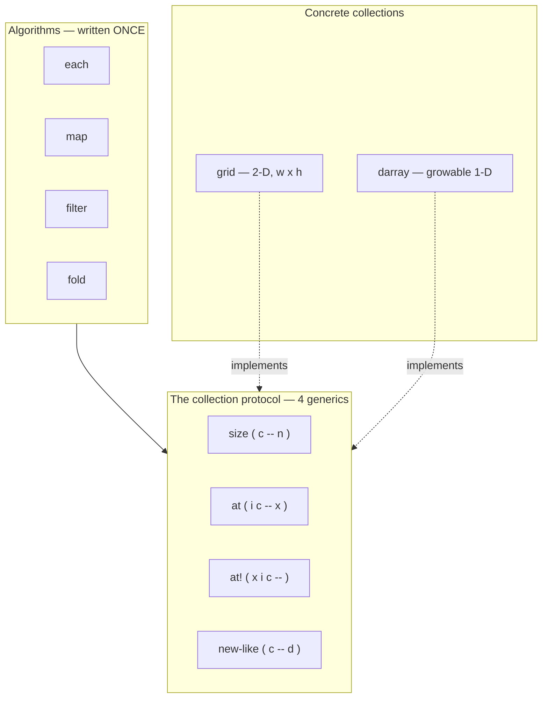

# Collections — the protocol reference

This is the reference for **CoreProtocols Layer 1**: the collection
protocol and the two collections that ship today (`grid` and `darray`),
plus the algorithms that ride the protocol.

If you want the *why* — the CLOS dispatch model, the layer map, the
design rationale — read [CoreProtocols](coreprotocols.md). This page is
the *what*: every word, its stack effect, and a worked example.

Everything here is ordinary Forth written on the object system. To use
it, load the library file:

```forth
INCLUDE lib/collections.f
```

---

## The idea in one picture

A **protocol** is a small set of generic functions. Write an algorithm
once against the protocol and it runs on *any* class that implements it
— no per-class iteration code, ever.



The payoff is *openness*: a class you write later joins the protocol by
implementing those four generics, and every algorithm below works on it
immediately.

---

## The collection protocol

Four generics. A class becomes a collection by answering all four.

| word       | stack effect      | role                                            |
|------------|-------------------|-------------------------------------------------|
| `size`     | `( c -- n )`      | element count                                   |
| `at`       | `( i c -- x )`    | read the element at linear index `i` (0-based)  |
| `at!`      | `( x i c -- )`    | write `x` at linear index `i`                   |
| `new-like` | `( c -- d )`      | a fresh, empty collection of `c`'s own type     |

**Argument-order rule.** Accessors put the **collection on top** of the
stack (`at ( i c )`, `at! ( x i c )`). This matches Factor's own
`nth`/`set-nth` family and means a collection held across a loop stays
reachable with `dup` rather than `rot`. Combinators, by contrast, put
the **quotation on top** (`each ( c xt )`), so code reads
`collection ' word each`.

**`new-like` and type preservation.** `new-like` is what lets `map`
return the *same kind* of collection it was given. A grid maps to a
grid; a darray maps to a darray. You rarely call `new-like` directly —
it exists so the algorithms stay backing-agnostic.

---

## grid — a 2-D mutable store

A rectangular, fixed-size cell store, addressed by `(x, y)`.

- **0-based**: the first cell is `(0, 0)`.
- **`(x, y)` order**: column first, then row — matching canvas
  coordinates, so the GUI layer and the grid agree.
- **row-major**: the linear index (used by `at`/`at!`/`each`) is
  `y * width + x`.

| word          | stack effect       | description                                   |
|---------------|--------------------|-----------------------------------------------|
| `new-grid`    | `( w h -- g )`     | allocate a `w x h` grid, all cells zeroed      |
| `grid-w`      | `( g -- w )`       | width                                          |
| `grid-h`      | `( g -- h )`       | height                                         |
| `at-xy`       | `( x y g -- v )`   | read the cell at `(x, y)` — no bounds check    |
| `at-xy!`      | `( v x y g -- )`   | write `v` to the cell at `(x, y)`              |
| `in-bounds?`  | `( x y g -- ? )`   | true iff `(x, y)` is inside the grid           |

`grid` also implements the full collection protocol: `size` is `w*h`,
and `at`/`at!` give a linear, row-major view alongside the 2-D `at-xy`.

```forth
\ a 3-wide, 2-tall board
3 2 new-grid VALUE board

11  0 0 board at-xy!      \ set (0,0)
22  2 0 board at-xy!      \ set (2,0)
0 0 board at-xy .         \ 11
2 0 board at-xy .         \ 22
1 0 board at-xy .         \ 0   (untouched cells read 0)

3 0 board in-bounds? .    \ 0   (x == w, out of bounds)
2 1 board in-bounds? .    \ -1  (far corner, in bounds)

board size .              \ 6   (the linear view: 3 * 2 cells)
```

> Pair `at-xy`/`at-xy!` with `in-bounds?` when the coordinates aren't
> already known good — the accessors themselves do not bounds-check.

---

## darray — a growable sequence

A dynamic 1-D array (the name is short for *dynamic array*; it's our
standard growable vector). It grows on `d-push` and holds any value per
element.

| word         | stack effect   | description                          |
|--------------|----------------|--------------------------------------|
| `new-darray` | `( -- d )`     | a fresh, empty darray                |
| `d-push`     | `( x d -- )`   | append `x` to the end                |

`darray` implements the collection protocol: `size` is its length,
`at`/`at!` index it, and writing past the end via `at!` grows it.

```forth
new-darray VALUE xs
10 xs d-push
20 xs d-push
30 xs d-push
xs size .          \ 3
0 xs at .          \ 10
2 xs at .          \ 30
99 1 xs at!        \ overwrite element 1
1 xs at .          \ 99
```

---

## Algorithms over the protocol

These are written **once**, against `size`/`at`/`new-like`. They work
on a grid, a darray, and anything you add later. The transform/predicate
is an **execution token** — get one with `'` (tick): `xs ' . each`.

| word     | stack effect          | the xt it takes        | result                          |
|----------|-----------------------|------------------------|---------------------------------|
| `each`   | `( c xt -- )`         | `( x -- )`             | runs xt once per element        |
| `map`    | `( c xt -- d )`       | `( x -- y )`           | a new collection of c's type    |
| `filter` | `( c xt -- d )`       | `( x -- ? )`           | a darray of the elements kept   |
| `fold`   | `( c init xt -- acc )`| `( acc x -- acc )`     | the threaded accumulator        |

### each — run an xt over every element

```forth
new-darray VALUE xs
2 xs d-push  3 xs d-push  4 xs d-push
xs ' . each              \ prints: 2 3 4
```

### map — transform, preserving type

`map` returns a collection of the **input's own type**, so 2-D
structure and length survive the transform.

```forth
: dbl ( n -- n2 ) 2 * ;

\ darray -> darray
new-darray VALUE xs
5 xs d-push  6 xs d-push  7 xs d-push
xs ' dbl map VALUE ys
ys ' . each              \ 10 12 14

\ grid -> grid (same dimensions, doubled cells)
2 2 new-grid VALUE g
1  0 0 g at-xy!   2  1 0 g at-xy!
3  0 1 g at-xy!   4  1 1 g at-xy!
g ' dbl map VALUE g2
0 0 g2 at-xy .           \ 2
1 1 g2 at-xy .           \ 8
g2 grid-w . g2 grid-h .  \ 2 2  (still a 2x2 grid)
```

### filter — keep the matching elements

```forth
: even? ( n -- ? ) 2 mod 0= ;

new-darray VALUE xs
1 xs d-push  2 xs d-push  3 xs d-push
4 xs d-push  5 xs d-push  6 xs d-push
xs ' even? filter VALUE ys
ys size .                \ 3
ys ' . each              \ 2 4 6
```

### fold — the general reducer

`fold` threads an accumulator through every element, left to right. The
other algorithms are special cases of it; a sum is just `0 ' + fold`.

```forth
new-darray VALUE xs
1 xs d-push  2 xs d-push  3 xs d-push  4 xs d-push
xs 0   ' + fold .        \ 10   (1+2+3+4)
xs 100 ' - fold .        \ 90   (left-to-right: ((((100-1)-2)-3)-4))
```

---

## Extending the protocol

To make your own class a collection, implement the four generics. Once
you do, **every algorithm above works on it for free** — that's the
whole point of writing them against the protocol instead of the type.

```forth
CLASS: ring SLOT: ... ;          \ your backing
METHOD: size     ( c:ring -- n )    ... ;
METHOD: at       ( i c:ring -- x )  ... ;
METHOD: at!      ( x i c:ring -- )  ... ;
METHOD: new-like ( c:ring -- d )    ... ;   \ a fresh, empty ring

\ now this just works:
my-ring ' dbl map
my-ring 0 ' + fold
```

> **Implementation note.** A `METHOD:` body is emitted before plain `:`
> definitions in the same compile, so a method must not call a `:` word
> defined later in the same file. Build inside `new-like` from the
> auto-generated boa constructor (`<ring>`) and slot accessors, which
> are always available — not from a `:` helper.

---

Back to [Home](index.md) | [CoreProtocols (design)](coreprotocols.md) |
[Classes and methods](classes.md)
