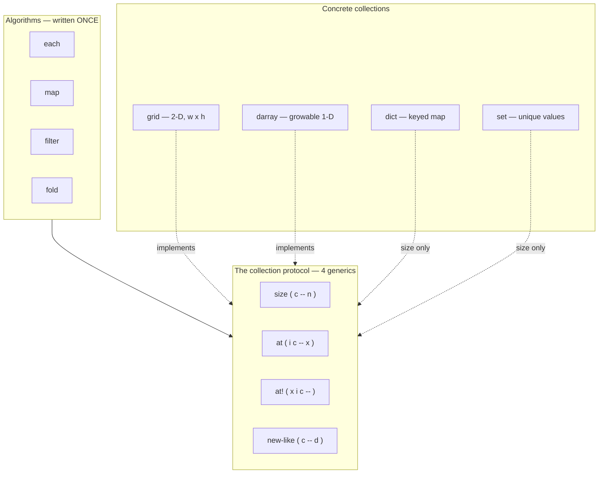

# Collections — the protocol reference

This is the reference for **CoreProtocols Layer 1**: the collection
protocol and the collections that ship today (`grid`, `darray`, `dict`,
and `set`),
plus the algorithms that ride the protocol.

If you want the *why* — the CLOS dispatch model, the layer map, the
design rationale — read [CoreProtocols](coreprotocols.md). This page is
the *what*: every word, its stack effect, and a worked example.

Everything here is ordinary Forth written on the object system. Load
Layer 0 first — the value-search words (`member?`, `index-of`) build on
its `equals?`. `NEEDS` pulls a file in once (a repeat is a no-op), so
it's safe to list every dependency:

```forth
NEEDS lib/core.f
NEEDS lib/collections.f
```

---

## The idea in one picture

A **protocol** is a small set of generic functions. Write an algorithm
once against the protocol and it runs on *any* class that implements it
— no per-class iteration code, ever.



The payoff is *openness*: a class you write later joins the protocol by
implementing those four generics, and every algorithm below works on it
immediately.

---

## The collection protocol

Four generics. A class becomes a collection by answering all four.

| word       | stack effect      | role                                            |
|------------|-------------------|-------------------------------------------------|
| `size`     | `( c -- n )`      | element count                                   |
| `at`       | `( i c -- x )`    | read the element at linear index `i` (0-based)  |
| `at!`      | `( x i c -- )`    | write `x` at linear index `i`                   |
| `new-like` | `( c -- d )`      | a fresh, empty collection of `c`'s own type     |

**Argument-order rule.** Accessors put the **collection on top** of the
stack (`at ( i c )`, `at! ( x i c )`). This matches Factor's own
`nth`/`set-nth` family and means a collection held across a loop stays
reachable with `dup` rather than `rot`. Combinators, by contrast, put
the **quotation on top** (`each ( c xt )`), so code reads
`collection ' word each`.

**`new-like` and type preservation.** `new-like` is what lets `map`
return the *same kind* of collection it was given. A grid maps to a
grid; a darray maps to a darray. You rarely call `new-like` directly —
it exists so the algorithms stay backing-agnostic.

---

## grid — a 2-D mutable store

A rectangular, fixed-size cell store, addressed by `(x, y)`.

- **0-based**: the first cell is `(0, 0)`.
- **`(x, y)` order**: column first, then row — matching canvas
  coordinates, so the GUI layer and the grid agree.
- **row-major**: the linear index (used by `at`/`at!`/`each`) is
  `y * width + x`.

| word          | stack effect       | description                                   |
|---------------|--------------------|-----------------------------------------------|
| `new-grid`    | `( w h -- g )`     | allocate a `w x h` grid, all cells zeroed      |
| `grid-w`      | `( g -- w )`       | width                                          |
| `grid-h`      | `( g -- h )`       | height                                         |
| `at-xy`       | `( x y g -- v )`   | read the cell at `(x, y)` — no bounds check    |
| `at-xy!`      | `( v x y g -- )`   | write `v` to the cell at `(x, y)`              |
| `in-bounds?`  | `( x y g -- ? )`   | true iff `(x, y)` is inside the grid           |

`grid` also implements the full collection protocol: `size` is `w*h`,
and `at`/`at!` give a linear, row-major view alongside the 2-D `at-xy`.

```forth
\ a 3-wide, 2-tall board
3 2 new-grid VALUE board

11  0 0 board at-xy!      \ set (0,0)
22  2 0 board at-xy!      \ set (2,0)
0 0 board at-xy .         \ 11
2 0 board at-xy .         \ 22
1 0 board at-xy .         \ 0   (untouched cells read 0)

3 0 board in-bounds? .    \ 0   (x == w, out of bounds)
2 1 board in-bounds? .    \ -1  (far corner, in bounds)

board size .              \ 6   (the linear view: 3 * 2 cells)
```

> Pair `at-xy`/`at-xy!` with `in-bounds?` when the coordinates aren't
> already known good — the accessors themselves do not bounds-check.

---

## darray — a growable sequence

A dynamic 1-D array (the name is short for *dynamic array*; it's our
standard growable vector). It grows on `d-push` and holds any value per
element.

| word         | stack effect   | description                          |
|--------------|----------------|--------------------------------------|
| `new-darray` | `( -- d )`     | a fresh, empty darray                |
| `d-push`     | `( x d -- )`   | append `x` to the end                |

`darray` implements the collection protocol: `size` is its length,
`at`/`at!` index it, and writing past the end via `at!` grows it.

```forth
new-darray VALUE xs
10 xs d-push
20 xs d-push
30 xs d-push
xs size .          \ 3
0 xs at .          \ 10
2 xs at .          \ 30
99 1 xs at!        \ overwrite element 1
1 xs at .          \ 99
```

---

## dict — a key→value map

A hashtable-backed map. Keys and values are any value; lookup, insert,
and membership are O(1). A dict is a *keyed* collection, not a
positional one — it implements `size` but not the linear `at`/`at!`.
Iterate it through `dict-keys` / `dict-values`, which return a darray
that supports the full sequence protocol (each / map / fold).

| word          | stack effect          | description                                   |
|---------------|-----------------------|-----------------------------------------------|
| `new-dict`    | `( -- d )`            | a fresh, empty dict                           |
| `dict-set`    | `( value key d -- )`  | store `value` under `key` (overwrites)        |
| `dict-at`     | `( key d -- value ? )`| look up — value **and** a found flag          |
| `dict-has?`   | `( key d -- ? )`      | is `key` present?                             |
| `dict-del`    | `( key d -- )`        | remove `key`                                  |
| `dict-keys`   | `( d -- darray )`     | the keys, as a darray                         |
| `dict-values` | `( d -- darray )`     | the values, as a darray                       |

`dict-at` returns two values — the value and a found flag — so a stored
`0` is never mistaken for "missing" (the same idiom as `find`).

```forth
new-dict VALUE d
111 1 d dict-set         \ d[1] = 111
222 2 d dict-set
333 1 d dict-set         \ overwrite key 1
d size .                 \ 2
1 d dict-has? .          \ -1
1 d dict-at swap . .     \ 333 -1   (value, found)
d dict-keys 0 ' + fold . \ 3   (keys feed the algorithms)
1 d dict-del
1 d dict-has? .          \ 0
```

## set — unique values

A hash-set: a collection of distinct values, with O(1) membership.
`set-has?` is the fast, hash-based test — distinct from the sequence
`member?`, which scans linearly through `equals?`. Like dict, a set is
unordered (`size` yes, linear `at` no); iterate via `set-members`.

| word          | stack effect      | description                          |
|---------------|-------------------|--------------------------------------|
| `new-set`     | `( -- s )`        | a fresh, empty set                   |
| `set-add`     | `( elt s -- )`    | add `elt` (a duplicate is a no-op)   |
| `set-has?`    | `( elt s -- ? )`  | is `elt` a member?                   |
| `set-del`     | `( elt s -- )`    | remove `elt`                         |
| `set-members` | `( s -- darray )` | the members, as a darray             |

```forth
new-set VALUE st
10 st set-add
20 st set-add
10 st set-add            \ duplicate — no-op
st size .                \ 2
10 st set-has? .         \ -1
99 st set-has? .         \ 0
st set-members 0 ' + fold .   \ 30
```

---

## Algorithms over the protocol

These are written **once**, against `size`/`at`/`new-like`. They work
on a grid, a darray, and anything you add later. The transform/predicate
is an **execution token** — get one with `'` (tick): `xs ' . each`.

| word      | stack effect          | the xt it takes        | result                          |
|-----------|-----------------------|------------------------|---------------------------------|
| `each`    | `( c xt -- )`         | `( x -- )`             | runs xt once per element        |
| `map`     | `( c xt -- d )`       | `( x -- y )`           | a new collection of c's type    |
| `filter`  | `( c xt -- d )`       | `( x -- ? )`           | a darray of the elements kept   |
| `fold`    | `( c init xt -- acc )`| `( acc x -- acc )`     | the threaded accumulator        |
| `tally`   | `( c xt -- n )`       | `( x -- ? )`           | how many elements match         |
| `any?`    | `( c xt -- ? )`       | `( x -- ? )`           | true iff some element matches   |
| `all?`    | `( c xt -- ? )`       | `( x -- ? )`           | true iff every element matches  |
| `find`    | `( c xt -- x ? )`     | `( x -- ? )`           | first match + a found flag      |
| `sum`     | `( c -- n )`          | —                      | `0 ' + fold` (numbers)          |
| `product` | `( c -- n )`          | —                      | `1 ' * fold` (numbers)          |

And two that search by **value** rather than a predicate — they compare
with Layer 0's `equals?`, so they respect a class's own equality:

| word       | stack effect      | result                                  |
|------------|-------------------|-----------------------------------------|
| `member?`  | `( x c -- ? )`    | true iff some element equals `x`        |
| `index-of` | `( x c -- i ? )`  | index of the first match + a found flag |

### each — run an xt over every element

```forth
new-darray VALUE xs
2 xs d-push  3 xs d-push  4 xs d-push
xs ' . each              \ prints: 2 3 4
```

### map — transform, preserving type

`map` returns a collection of the **input's own type**, so 2-D
structure and length survive the transform.

```forth
: dbl ( n -- n2 ) 2 * ;

\ darray -> darray
new-darray VALUE xs
5 xs d-push  6 xs d-push  7 xs d-push
xs ' dbl map VALUE ys
ys ' . each              \ 10 12 14

\ grid -> grid (same dimensions, doubled cells)
2 2 new-grid VALUE g
1  0 0 g at-xy!   2  1 0 g at-xy!
3  0 1 g at-xy!   4  1 1 g at-xy!
g ' dbl map VALUE g2
0 0 g2 at-xy .           \ 2
1 1 g2 at-xy .           \ 8
g2 grid-w . g2 grid-h .  \ 2 2  (still a 2x2 grid)
```

### filter — keep the matching elements

```forth
: even? ( n -- ? ) 2 mod 0= ;

new-darray VALUE xs
1 xs d-push  2 xs d-push  3 xs d-push
4 xs d-push  5 xs d-push  6 xs d-push
xs ' even? filter VALUE ys
ys size .                \ 3
ys ' . each              \ 2 4 6
```

### fold — the general reducer

`fold` threads an accumulator through every element, left to right. The
other algorithms are special cases of it; a sum is just `0 ' + fold`.

```forth
new-darray VALUE xs
1 xs d-push  2 xs d-push  3 xs d-push  4 xs d-push
xs 0   ' + fold .        \ 10   (1+2+3+4)
xs 100 ' - fold .        \ 90   (left-to-right: ((((100-1)-2)-3)-4))
```

### tally / any? / all? — the predicate family

These take a predicate `( x -- ? )` and ask a question of the whole
collection. `tally` counts the matches; `any?` is true if at least one
matches; `all?` is true if every element matches (and so is vacuously
true for an empty collection).

```forth
: even? ( n -- ? ) 2 mod 0= ;

new-darray VALUE xs
1 xs d-push  2 xs d-push  3 xs d-push
4 xs d-push  5 xs d-push  6 xs d-push
xs ' even? tally .       \ 3   (2, 4, 6)
xs ' even? any? .        \ -1  (some are even)
xs ' even? all? .        \ 0   (not all are even)
```

### find — the first match

`find` returns two things: the first element satisfying the predicate,
and a found flag. The flag is what you branch on — so `0` is a perfectly
valid element, never confused with "not found".

```forth
xs ' even? find          \ ( 2 -1 )  — first even is 2, found
\ stack now holds: element below, flag on top
if  ." first even: " .  else  drop ." none"  then
```

### sum / product — numeric reductions

The two folds you reach for most, with their identity element baked in.
Number collections only.

```forth
xs sum .                 \ 21   (1+2+3+4+5+6)
xs product .             \ 720
```

### member? / index-of — search by value

Where `find` takes a predicate, these take a *value* and compare it
against each element with Layer 0's `equals?`. Because `equals?` is an
overridable generic, a class that defines its own equality is searched
on its own terms — for free.

```forth
new-darray VALUE xs
10 xs d-push  20 xs d-push  30 xs d-push  20 xs d-push
20 xs member? .          \ -1  (present)
99 xs member? .          \  0  (absent)

\ index-of returns the FIRST position plus a found flag
20 xs index-of           \ ( 1 -1 )  — first 20 is at index 1
\ a miss gives index 0 and a false flag, so 0 is never ambiguous
99 xs index-of           \ ( 0 0 )
```

> `equals?` lives in Layer 0 (`core.f`); its default is value/structural
> equality. Override it for a class — `METHOD: equals? ( a b:account -- ? )`
> — and every value search here follows suit. See
> [Classes and methods](classes.md).

### clone — independent copies

`clone ( x -- copy )` is Layer 0's copy protocol. Its default is a
*shallow* copy (it duplicates a class's immediate slots). A collection
owns a mutable backing store, so a shallow copy would share it — which
is why `grid` and `darray` override `clone` to copy the backing too.
The result is fully independent: mutating a clone never touches the
original.

```forth
2 2 new-grid VALUE g
5  0 0 g at-xy!
g clone VALUE g2
99 0 0 g2 at-xy!         \ scribble on the copy
0 0 g  at-xy .           \ 5   (original untouched)
0 0 g2 at-xy .           \ 99
```

---

## Ordered algorithms

These ride **two** protocols at once: the collection protocol
(`size`/`at`/`at!`) and Layer 0's [ordering protocol](core.md#ordering--cmp)
(`cmp`). Written once, they work on any collection whose elements
implement `cmp` — numbers out of the box, your own classes the moment
they answer `cmp`. (Load `lib/core.f` first.)

| word       | stack effect   | result                                       |
|------------|----------------|----------------------------------------------|
| `min-of`   | `( c -- x )`   | least element by `cmp` (non-empty)           |
| `max-of`   | `( c -- x )`   | greatest element by `cmp` (non-empty)        |
| `sorted?`  | `( c -- ? )`   | is `c` in non-decreasing `cmp` order?        |
| `sort`     | `( c -- )`     | sort `c` **in place** by `cmp`               |

`min-of` / `max-of` are single-pass folds (seeded with the first
element, hence the non-empty requirement). `sorted?` walks adjacent
pairs and is vacuously true for 0 or 1 elements. `sort` is an in-place
insertion sort — simple and obviously correct, O(n²), which suits the
small in-memory collections these protocols target; it mutates through
`at!`, so the collection must be writable at every index (grid and
darray are).

```forth
new-darray VALUE xs
3 xs d-push  1 xs d-push  4 xs d-push  1 xs d-push  5 xs d-push

xs min-of .              \ 1
xs max-of .              \ 5
xs sorted? .             \ 0    (3 1 4 1 5 isn't ordered)
xs sort
xs sorted? .             \ -1   (now it is)
0 xs at .                \ 1
4 xs at .                \ 5
```

Because they're written against `cmp`, a class that defines its own
ordering sorts correctly with no extra code:

```forth
\ given  METHOD: cmp ( a b:card -- n ) … ;  (see core.md)
my-hand sort             \ orders the cards by rank
```

---

## Conveniences and reshaping

A handful of small words that ride the same `size` / `at` / `at!` /
`new-like` protocol. None of them are new mechanism — they're shortcuts
that read better than the inline forms.

| word          | stack effect       | result                                       |
|---------------|--------------------|----------------------------------------------|
| `empty?`      | `( c -- ? )`       | true iff `size` is zero                      |
| `first`       | `( c -- x )`       | element at index 0 (non-empty)               |
| `last`        | `( c -- x )`       | element at the last index (non-empty)        |
| `reverse`     | `( c -- d )`       | a fresh collection in reverse order (uses `new-like`) |
| `take`        | `( c n -- d )`     | the first `n` elements as a **darray** (clamps to `size`) |
| `skip`        | `( c n -- d )`     | everything from index `n` onward as a **darray** (clamps to `size`) |
| `concat`      | `( a b -- c )`     | a fresh darray with `a` then `b` appended    |

`reverse` preserves type (grid→grid, darray→darray) via `new-like`.
`take`/`skip`/`concat` always return a darray because the result shape
no longer matches the input (slicing a grid is not a grid).

```forth
new-darray VALUE xs
1 xs d-push  2 xs d-push  3 xs d-push  4 xs d-push  5 xs d-push

xs empty? .              \ 0
xs first . xs last .     \ 1 5

xs reverse VALUE ys
0 ys at .                \ 5

xs 3 take 0 ' + fold .   \ 6   (1+2+3)
xs 3 skip size .         \ 2   (just 4 and 5)
```

## Positional iteration and reduction

| word          | stack effect       | xt                  | what it does                                  |
|---------------|--------------------|---------------------|-----------------------------------------------|
| `each-index`  | `( c xt -- )`      | `( i x -- )`        | like `each` but the xt also sees the index    |
| `map-index`   | `( c xt -- d )`    | `( i x -- y )`      | like `map` but the xt also sees the index     |
| `reduce`      | `( c xt -- x )`    | `( acc x -- acc )`  | `fold` without an explicit init — seeds with `c[0]` (non-empty) |
| `partition`   | `( c xt -- yes no )` | `( x -- ? )`      | like `filter` but returns BOTH the kept and the discarded as two darrays, in matching order |

`reduce` pairs nicely with the ordering protocol — `xs ' lesser reduce`
is the minimum, `xs ' greater reduce` is the maximum, without needing a
sentinel init:

```forth
new-darray VALUE xs
4 xs d-push  1 xs d-push  3 xs d-push  2 xs d-push  5 xs d-push

xs ' + reduce .          \ 15  (sum, no seed)
xs ' lesser reduce .     \ 1   (min via Layer 0 ordering)

\ classic split:
: even? ( n -- ? ) 2 mod 0= ;
xs ' even? partition     \ stack: yes no   (use TO to bind both)
```

---

## Extending the protocol

To make your own class a collection, implement the four generics. Once
you do, **every algorithm above works on it for free** — that's the
whole point of writing them against the protocol instead of the type.

```forth
CLASS: ring SLOT: ... ;          \ your backing
METHOD: size     ( c:ring -- n )    ... ;
METHOD: at       ( i c:ring -- x )  ... ;
METHOD: at!      ( x i c:ring -- )  ... ;
METHOD: new-like ( c:ring -- d )    ... ;   \ a fresh, empty ring
METHOD: clone    ( c:ring -- copy ) ... ;   \ copy the backing (see below)

\ now this just works:
my-ring ' dbl map
my-ring 0 ' + fold
```

If your class owns a mutable backing store, override `clone` too — the
default is shallow and would share that store. `(clone)` deep-copies a
Factor array or vector, so a one-liner over the backing usually does it.

> **Implementation note.** A `METHOD:` body is emitted before plain `:`
> definitions in the same compile, so a method must not call a `:` word
> defined later in the same file. Build inside `new-like` from the
> auto-generated boa constructor (`<ring>`) and slot accessors, which
> are always available — not from a `:` helper.

---

Back to [Home](index.md) | [CoreProtocols (design)](coreprotocols.md) |
[Classes and methods](classes.md)
