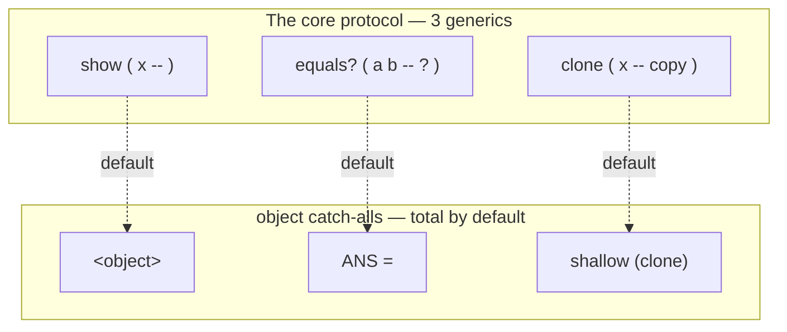

# Core protocol — show, equals?, clone

CoreProtocols **Layer 0**: the root protocol every later class can opt
into. It is deliberately tiny — three generic functions, each with a
sensible catch-all default — so a class *just works* before you
specialise anything, and reads better once you do.

If you want the *why* — the CLOS dispatch model, the layer map — read
[CoreProtocols](coreprotocols.md). This page is the *what*: every word,
its stack effect, the default behaviour, and how to override it.

Layer 0 is the foundation; load it first. Every other layer
(`collections`, `numerics`, `streams`) builds on it:

```forth
NEEDS lib/core.f
```

---

## The idea in one picture

A **protocol** is a small set of generic functions with default
methods. A class joins the protocol the moment it answers those
generics — and until it does, the `object` catch-all keeps every word
*total* (it never fails to have an answer).



| word       | stack effect      | role                                         | default            |
|------------|-------------------|----------------------------------------------|--------------------|
| `show`     | `( x -- )`        | human-readable rendering                     | prints `<object>`  |
| `show-ln`  | `( x -- )`        | `show` then a newline                        | — (over `show`)    |
| `equals?`  | `( a b -- ? )`    | value equality                               | ANS `=`            |
| `clone`    | `( x -- copy )`   | an independent copy                          | shallow copy       |

---

## show — a human-readable rendering

`show ( x -- )` prints the pretty, class-defined view of `x`. The
`object` catch-all prints `<object>`, so `show` is total for anything
you haven't taught it yet; add a `METHOD: show` for your own class to
do better.

```forth
GENERIC: show ( x -- )
METHOD: show ( x:object -- )  drop ." <object>" ;   \ the default
```

`show` is distinct from `DUMP`: `show` is the *pretty* view a class
defines for itself, `DUMP` is the raw type+bytes debugging view that
works on anything. Use `show` in output, `DUMP` at the debugger.

```forth
CLASS: point SLOT: x SLOT: y ;
METHOD: show ( p:point -- )
    ." (" dup point>x . ." , " point>y . ." )" ;

3 4 <point> show        \ ( 3 , 4 )
```

### show-ln — show and a newline

`show-ln ( x -- )` is `show` followed by `cr` — the common interactive
case. It's defined **once** over the generic, so it works for every
class that implements `show`, with nothing extra to write.

```forth
: show-ln ( x -- )  show cr ;

3 4 <point> show-ln     \ ( 3 , 4 ) then a newline
```

---

## equals? — value equality

`equals? ( a b -- ? )` is the equality hook the collection searches
dispatch through — `member?` and `index-of` (Layer 1) compare with
`equals?`, so they honour whatever equality a class defines.

The default is ANS `=`, which is already structural: it compares
numbers and characters by value, and (because the substrate does the
same) like-shaped objects by their contents. So two `point`s with equal
slots already compare equal with no method written.

```forth
GENERIC: equals? ( a b -- ? )
METHOD: equals? ( a b:object -- ? )  = ;   \ the default — structural
```

Override it for a class that wants its *own* notion of equality — say,
comparing only an id slot:

```forth
CLASS: account SLOT: id SLOT: balance ;
METHOD: equals? ( a b:account -- ? )
    account>id swap account>id = ;          \ equal iff same id

1 100 <account>  1 999 <account>  equals? .   \ -1  (same id, different balance)
```

It is distinct from ANS `=` only in being **open**: your method joins
the protocol without touching the library, and every value search
(`member?`, `index-of`) follows suit automatically.

---

## clone — an independent copy

`clone ( x -- copy )` returns an independent copy of `x`. The default is
a **shallow** structural copy: it duplicates `x`'s immediate slots, but
a slot that *holds another object* still points at the same object.
That's the right default for value-like classes (a point, a colour) and
for numbers and strings, which clone to an equal value.

```forth
GENERIC: clone ( x -- copy )
METHOD: clone ( x:object -- copy )  (clone) ;   \ the default — shallow
```

`(clone)` is the deep-copy primitive over the Factor backing — it's the
tool an override reaches for.

### When you must override clone

A class that **owns a mutable backing store** must override `clone` to
copy that store too, or the "copy" will share state with the original.
This is exactly why the Layer 1 collections (`grid`, `darray`, `dict`,
`set`) provide their own `clone` methods:

```forth
METHOD: clone ( g:grid -- copy )
    dup grid>w over grid>h          \ g w h
    rot grid>cells (clone)          \ w h cells'   — copy the backing
    <grid> ;
```

The result is fully independent — mutating the clone never touches the
original:

```forth
2 2 new-grid VALUE g
5  0 0 g at-xy!
g clone VALUE g2
99 0 0 g2 at-xy!        \ scribble on the copy
0 0 g  at-xy .          \ 5    (original untouched)
0 0 g2 at-xy .          \ 99
```

> **Rule of thumb.** If your class holds only values (numbers,
> characters, immutable references), the shallow default is correct.
> If it owns a mutable array, vector, hashtable, or another mutable
> object, override `clone` to `(clone)` that backing. See
> [Collections → clone](collections.md).

---

## Extending the protocol

To teach the core protocol about your class, add a method to whichever
generics matter. None are mandatory — the `object` defaults keep each
word total — but a `show` method is almost always worth it, and you
override `equals?` / `clone` only when the default is wrong for your
type.

```forth
CLASS: money SLOT: cents ;
METHOD: show    ( m:money -- )      ." $" money>cents . ;
METHOD: equals? ( a b:money -- ? )  money>cents swap money>cents = ;
\ clone: cents is a value, so the shallow default is already correct.
```

---

Back to [Home](index.md) | [CoreProtocols (design)](coreprotocols.md) |
[Classes and methods](classes.md) | [Collections](collections.md) |
[Numerics](numerics.md) | [Text & streams](streams.md)
