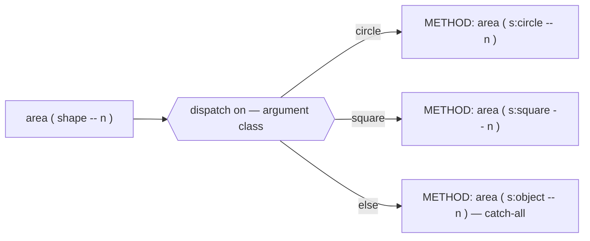
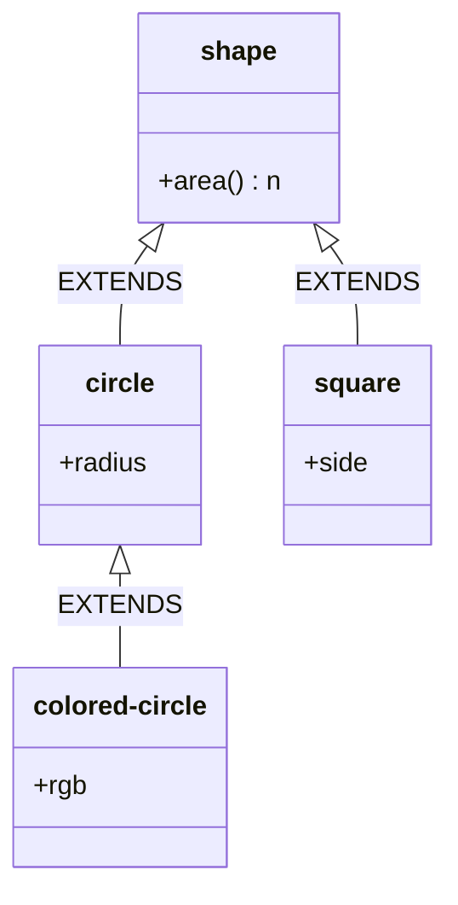
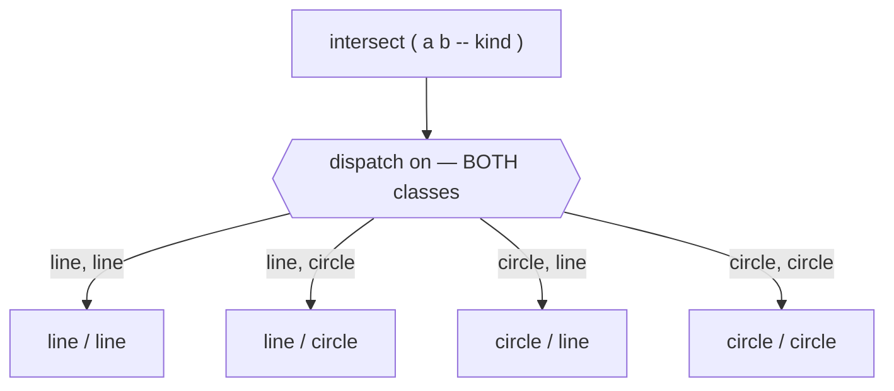
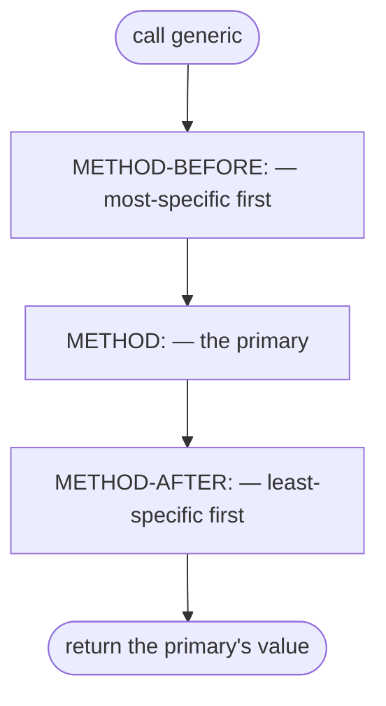
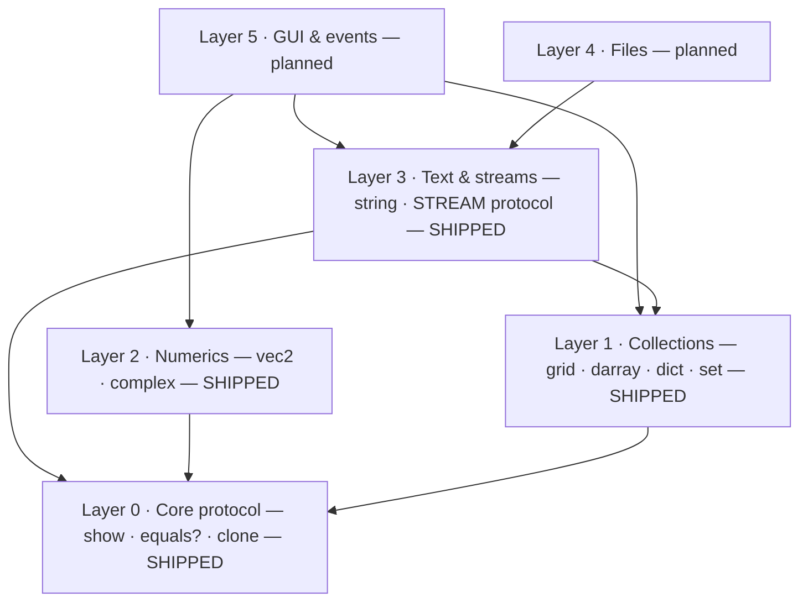
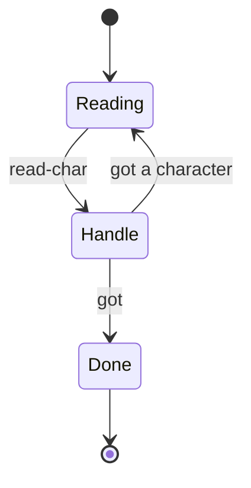
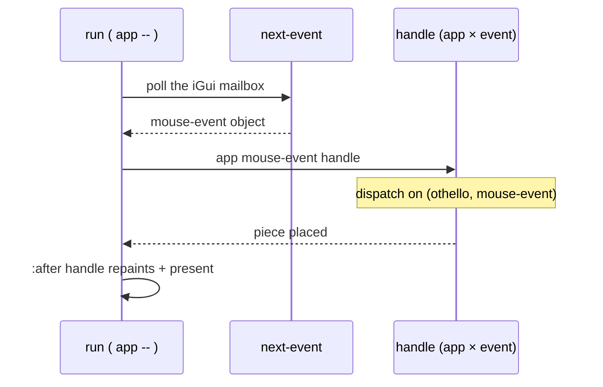
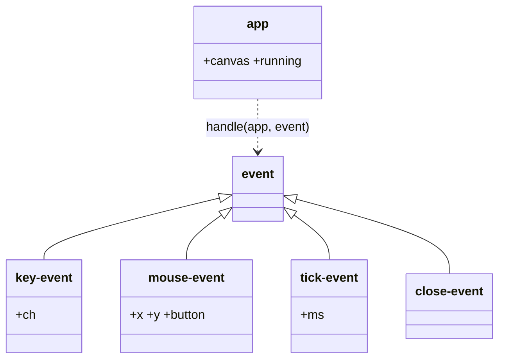

# CoreProtocols

Factor4th's object system is **CLOS-flavoured**, not Smalltalk-flavoured.
You don't send a message to an object; you call a **generic function**
that dispatches on the classes of its arguments. **CoreProtocols** is
the standard library being built on top of that idea — organised
around *protocols* (named sets of generic functions a class can
implement) rather than inheritance trees.

This page is diagram-heavy on purpose: the shapes carry the model.

---

## The model: verb-first dispatch

In a message-passing system the object owns the verb
(`circle draw:`). In CLOS — and here — the **verb is a generic
function** and the object is just one of its arguments. Dispatch
picks the most specific method for the actual argument classes.



The payoff: protocols are **open**. Because dispatch is multi-method,
*your* class can satisfy a *library* protocol just by adding a
method — no edit to the library, no subclassing ceremony.

---

## What ships today

The mechanism is complete and in the box: classes with slots, single
inheritance, generic functions, multiple dispatch, and `:before` /
`:after` method combinations.

### Classes and single inheritance

`CLASS: … EXTENDS …` builds a record type with named slots. Children
inherit their parent's slots and accessors. Composition (a slot that
*holds* another object) is preferred over deep trees.



```forth
CLASS: shape ;
CLASS: circle EXTENDS shape  SLOT: radius ;
CLASS: square EXTENDS shape  SLOT: side ;

GENERIC: area ( s -- n )
METHOD: area ( s:circle -- n )  radius>>circle dup * 3 * ;
METHOD: area ( s:square -- n )  side>>square   dup *     ;
```

### Multiple dispatch

A method can specialise on *more than one* argument; dispatch keys on
all of them. There's no privileged "receiver" — exactly the case
where message-passing systems resort to `instanceof` ladders.



### Method combinations: `:before` and `:after`

Auxiliary methods run *around* the primary without touching its body —
the home for guards, logging, audit, and repaint. Before-methods run
most-specific-first, after-methods least-specific-first, and the
primary's return value is what the caller sees.



This is also how construction layers itself: an `:after initialize`
on each class in a chain runs parent-before-child automatically — no
`call-next-method` required.

---

## CoreProtocols: the standard library

CoreProtocols layers reusable protocols on the object system. Each
layer is mostly pure Forth over a stolen Factor vocab; dependencies
flow downward only.



> **Status (2026-05-29).** The object system (the foundation above) and
> CoreProtocols **Layers 0–3** ship today, each with a reference page:
> [Core protocol](core.md) · [Collections](collections.md) ·
> [Numerics](numerics.md) · [Text & streams](streams.md). Layers 4
> (Files) and 5 (GUI & events) are **planned, not yet shipped** — the
> sketches below are roadmap, not API. (Graphics today is reached
> through the `gpane-*` FFI primitives, not a CLOS event protocol; see
> the `gfx-*` demos.)

### Streams: end-of-file is an object, not a flag

*(Layer 3 — shipped. Full reference: [Text & streams](streams.md).)*

A stream returns *one* value — a character, or the singleton
`<eof>` marker. You replace the `IF`/`WHILE` end check with
polymorphism: the read loop *is* the method table.



---

## Planned layers (not yet shipped)

The two layers below are **design, not API** — nothing here ships yet.
They're recorded so the staged build has a target to grow into.

### Files (Layer 4)

A `path` / `file` / `file-stream` trio that joins the Layer 3 STREAM
protocol: a `file-stream` would answer `read-char` / `write-char`, so
`copy-stream`, `read-line`, and friends work over files unchanged. The
point of building streams first: files become *just another stream*.

### Events (Layer 5): double dispatch on (app × event)

> **Not shipped.** Today, graphics is reached through the `gpane-*` FFI
> primitives (see the `gfx-shapes` / `gfx-mandelbrot` demos), and the
> Othello capstone renders as text. The CLOS event protocol sketched
> here is the planned successor, not current API.

The planned GUI event loop wraps each raw event into an **event
object**, then calls `handle ( app event -- )` — dispatching on the
*pair* `(your-app-class × event-class)`. Your app subclasses `app` and
writes the `handle` methods it cares about; the rest inherit a no-op.



An event class hierarchy keeps the dispatch tidy:



---

## Deliberate non-goals

- **Multiple inheritance** — Factor tuples are single-inheritance, and
  composition is the simpler discipline. Not a gap; a choice.
- **`:around` / `call-next-method`** — `multi-methods` has no
  `call-next-method`, so adding `:around` would mean reimplementing
  dispatch. `:before` / `:after` cover the practical cases.
- **Metaobject protocol** — out of scope for a Forth.

The line we hold: the Forth front end is grammar + desugar; the
runtime substrate is Factor's own tuple + generic machinery. We don't
reimplement dispatch — and you write Forth, never Factor.

---

Back to [Home](index.md) | [Classes and methods](classes.md) |
[Collections reference](collections.md)
