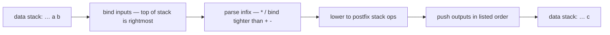

# LET algebra

Postfix Forth is great for some things — stack juggling, point-
free composition, embedded systems where every cycle counts.
For pure math, it's a chore.  Mapping `b^2 - 4ac` onto
`b dup * 4 a c * * -` is fine once but tedious every time.

Factor4th's **LET** is a tiny DSL that lets you write the
algebra naturally and have the compiler lower it to stack ops
for you.

## Syntax

```
LET (inputs) -> (outputs) =
    <infix expression>
END
```

- `inputs` are names bound from the stack, **top of stack is
  rightmost**.  So `LET (a b c) ... ` consumes `( a b c -- )`.
- `outputs` are names produced.  After the END the stack has
  the values of those names, in the listed order.
- The expression is plain infix arithmetic with the usual
  precedence: `* /` before `+ -`, parentheses override.

## Two grammars, one form

A LET form has a deliberate seam in the middle, and the two halves obey
different rules on purpose:

- **The `( … ) -> ( … )` lists are the Forth side.**  They name what
  comes off the stack and what goes back on — essentially a stack
  effect.  Forth doesn't punctuate those, so neither do we: names are
  separated by spaces, commas, or both.  `(a b)`, `(a, b)`, and
  `(a:point as x y  b)` all parse.

- **The `= … END` body is the DSL side.**  It is *not* Forth — it's an
  infix expression evaluator with its own grammar: precedence, `^`,
  `sqrt(…)`, unary minus.  Here a comma is a real piece of syntax (the
  separator between the components of a multi-valued result), exactly as
  in `(x, y)` on paper.  It is required, because DSL expressions contain
  spaces — `a + b  a - b` has no unambiguous split without it.

So the rule, in one line: **the parentheses speak Forth; the
equals-body speaks algebra.**  The separator flexibility lives only on
the Forth side; the comma inside the body is grammar, not optional
punctuation.

At compile time, the LET block flows through four steps — you
write the formula, the compiler hands the VM postfix stack ops:



## Example: hypotenuse

```forth
: hypot   ( a b -- c )
    LET (a b) -> (c) =
        sqrt (a * a + b * b)
    END
;
```

The squared sum is easy in bare Forth — but the square root isn't:
`sqrt` exists only as a **LET function**, not as a standalone Forth
word, so LET is what makes the one-liner above possible.

```forth
: sum-of-squares ( a b -- a^2+b^2 )
    dup *           \ b^2
    swap dup *      \ a^2 b^2
    +               \ a^2+b^2
;
```

The LET version reads like the formula you'd write on paper — and
gets you the `sqrt` for free.

## Operators

| operator | precedence | meaning             |
|----------|------------|---------------------|
| `+` `-`  | low        | add, subtract       |
| `*` `/`  | high       | multiply, divide    |
| `( )`    | -          | grouping            |

Unary minus is supported: `-1 * b` or just `0 - b`.

## Functions

These can appear as `name (expression)`:

- `sqrt` — square root
- `sin`, `cos`, `tan` — radians
- `ln`, `log` — natural and base-10 logarithm
- `exp` — `e^x`
- `abs` — absolute value
- `floor`, `ceil`, `round` — to nearest integer

Functions bind tighter than `*` / `/` / `+` / `-`, so
`sqrt b * c` is `(sqrt b) * c`, not `sqrt (b * c)`.  Use
parens if you mean the latter: `sqrt (b * c)`.

## Multiple outputs

```forth
: divmod ( a b -- a/b a%b )
    LET (a b) -> (q r) =
        a / b,
        a - q * b
    END
;
```

The output **names** `(q r)` may be separated by spaces or commas,
just like the inputs — see *Two grammars* below.  The result
**expressions** on the right of `=` are always comma-separated; that
comma is part of the DSL grammar, not optional punctuation.  The
right-hand side is parsed once but bindings resolve in order, so you can
reference an earlier output in a later one (`q` is bound before `r` is
computed).

## When NOT to use LET

LET is great for math.  It's overkill for:

- Single-operation words: `: double 2 * ;` doesn't need LET.
- Stack juggling that ISN'T math: `LET (a b) -> (b a) = ...`
  is just `swap`.
- Conditional logic: LET is expression-shaped, not statement-
  shaped.  Use plain Forth `if`/`then`/`case`/`endcase`.

A good heuristic: if writing the postfix version would make you
stop and trace stack pictures, write LET.  If it's obvious in
postfix, write postfix.

## Behind the scenes

LET runs at compile time, not runtime.  The compiler:

1. Lexes the source into LET tokens.
2. Parses to a postfix expression tree.
3. Topologically sorts the bindings.
4. Emits stack-shuffling code that produces the named values in
   the right order.
5. Hands the result off to the rest of the pipeline.

The runtime cost is exactly the same as the equivalent
hand-written Forth — LET is pure source-level sugar.

See `docs/journal/2026-05-xx-let-lang.md` in the source repo
for the design notes.
