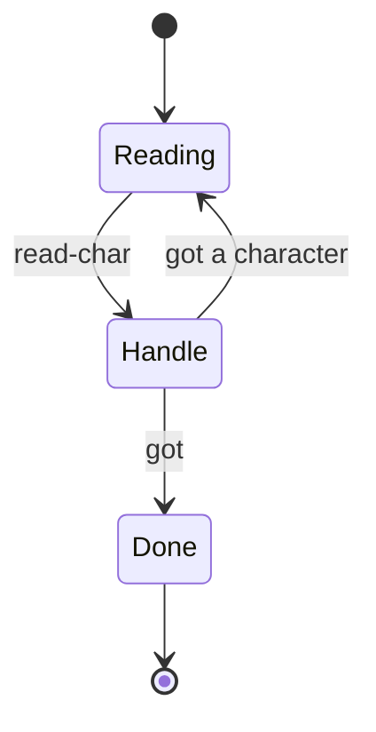

# Text & streams — strings and the stream protocol

CoreProtocols **Layer 3**: a proper `string` value type and the
**STREAM protocol**. Its signature idea is that **end-of-file is an
object** (`<eof>`), not a flag — `read-char` returns a character code
*or* the end marker, and the read loop dispatches on which it got. The
payoff: `copy-stream` is written **once** over the protocol and works
for any stream you define.

If you want the *why* — the CLOS dispatch model, the layer map — read
[CoreProtocols](coreprotocols.md). This page is the *what*: every word,
its stack effect, and a worked example.

Layer 3 builds on Layer 0 (`show` / `equals?`) and Layer 1 (`darray`,
`size`, `at`), so load those first:

```forth
NEEDS lib/core.f
NEEDS lib/collections.f
NEEDS lib/streams.f
```

---

## The classes

| class           | slots        | what it is                              |
|-----------------|--------------|-----------------------------------------|
| `string`        | `chars`      | a text value — a `darray` of char codes |
| `eof-marker`    | —            | the singleton end-of-stream object      |
| `string-reader` | `buf` `pos`  | an input stream over a string           |
| `string-writer` | `buf`        | an output stream collecting characters  |

> `CLASS: string` lives in the scratchpad vocab and coexists with
> Factor's native builtin `string` — we never name that builtin, so
> shadowing it here is inert.

---

## The string value type

A `string` wraps a `darray` of character codes, so it joins the
**collection protocol** (`size` / `at`) and the **core protocol**
(`show`) for free. Equality falls through to Layer 0's structural
default, which compares the character buffers element-wise.

| word            | stack effect        | description                                   |
|-----------------|---------------------|-----------------------------------------------|
| `new-string`    | `( -- s )`          | a fresh, empty string                         |
| `>string`       | `( c-addr u -- s )` | build a string from an ANS `c-addr u` literal |
| `string-push`   | `( ch s -- )`       | append one character code to `s`              |
| `string-append` | `( a b -- c )`      | concatenate into a **fresh** string           |
| `append-into`   | `( src dst -- )`    | append every char of `src` onto `dst`         |
| `show`          | `( s -- )`          | print the characters (core protocol)          |
| `size`          | `( s -- n )`        | length in characters (collection protocol)    |
| `at`            | `( i s -- ch )`     | the char code at index `i` (collection)       |

```forth
S" abc"   >string show                       \ abc
S" abcde" >string size .                     \ 5
1 S" abc" >string at .                       \ 98   (the code for 'b')

\ equality is structural — same characters compare equal
S" ab" >string  S" ab" >string equals? .     \ -1
S" ab" >string  S" ax" >string equals? .     \ 0

\ concatenation builds a new string; the inputs are untouched
S" foo" >string  S" bar" >string  string-append show   \ foobar
```

Because a string *is* a collection, the Layer 1 algorithms work on it
directly — iterating its character codes:

```forth
\ count the lowercase letters in a string
: lower? ( ch -- ? )  dup 97 >= swap 122 <= and ;
S" Hello, World" >string ' lower? tally .    \ 8
```

---

## The STREAM protocol

Two generics. A class becomes a stream by answering the one that fits
its direction — input, output, or both.

| word         | stack effect        | role                                      |
|--------------|---------------------|-------------------------------------------|
| `read-char`  | `( s -- ch \| eof )` | read one char, or the `<eof>` object      |
| `write-char` | `( ch s -- )`       | write one char to the stream              |

### EOF is an object, not a flag

`read-char` returns either a character code or the singleton `<eof>`
marker. You test for the end with `eof?` and branch on *that* — there's
no in-band sentinel value to collide with a real character.

| word   | stack effect     | description                            |
|--------|------------------|----------------------------------------|
| `eof`  | `( -- m )`       | the `<eof>` marker object              |
| `eof?` | `( x -- ? )`     | is `x` the `<eof>` marker?             |

```forth
S" Hi" str>reader VALUE r
r read-char emit                 \ H
r read-char emit                 \ i
r read-char eof? .               \ -1   drained — read-char returned <eof>

\ a non-empty reader's first read is a real char, not <eof>
S" x" str>reader read-char eof? .   \ 0
```

This is the move that replaces the `IF`/`WHILE` end-check with
polymorphism: the read loop *is* the method table.



---

## Readers & writers

A `string-reader` is an input stream over a string buffer; a
`string-writer` collects written characters into one.

| word            | stack effect        | description                                 |
|-----------------|---------------------|---------------------------------------------|
| `<reader>`      | `( buf -- s )`      | a reader over a `darray` of char codes      |
| `<writer>`      | `( -- w )`          | a fresh, empty writer                       |
| `string>reader` | `( s -- r )`        | a reader over a `string`                    |
| `str>reader`    | `( c-addr u -- r )` | a reader straight from an ANS literal       |
| `writer>string` | `( w -- s )`        | the writer's contents as a `string`         |
| `writer-emit`   | `( w -- )`          | `show` the writer's contents                |
| `reader-done?`  | `( s -- ? )`        | has the reader reached the end?             |

```forth
\ build output a character at a time, then render it
<writer> VALUE w
72  w write-char                 \ 'H'
105 w write-char                 \ 'i'
w writer-emit                    \ Hi
```

---

## Derived words — write once, work for any stream

These are written **once** against `read-char` / `write-char`, so they
work on any reader/writer pair — including streams you define later.
This is the whole point of the protocol.

| word          | stack effect    | description                                    |
|---------------|-----------------|------------------------------------------------|
| `copy-stream` | `( in out -- )` | pump every char from `in` to `out` until `<eof>` |
| `read-all`    | `( in -- w )`   | drain `in` into a fresh writer and return it   |

```forth
\ roundtrip: a reader drained into a writer reproduces the input
S" Hello, streams!" str>reader read-all writer-emit    \ Hello, streams!
```

The polymorphic-loop payoff: drop a *transforming* output under the
same loop and the copy transforms. Here a hand-written copy upper-cases
on the way through — the same `read-char` / `write-char` protocol, no
new loop:

```forth
: lower? ( ch -- ? )  dup 97 >= swap 122 <= and ;
: up     ( ch -- CH ) dup lower? IF 32 - THEN ;
: ucopy  ( in out -- )
    BEGIN
        over read-char
        dup eof? IF  drop -1  ELSE  up over write-char 0  THEN
    UNTIL 2drop ;

S" abcXYz!" str>reader <writer> dup >r ucopy r> writer-emit   \ ABCXYZ!
```

---

## Lines & fields

`read-line` pulls one newline-delimited line off a stream; `split` and
`join` break a string into fields and glue them back. The delimiter for
`split` / `join` is a **character code** (an integer) — write it as a
character literal like `','` or as its number `44`; either is the same
value. It's held safely in a variable across the loop.

| word        | stack effect          | description                                       |
|-------------|-----------------------|---------------------------------------------------|
| `read-line` | `( in -- s )`         | read up to a newline (code 10); newline consumed  |
| `split`     | `( s delim -- coll )` | break `s` on `delim` into a darray of strings     |
| `join`      | `( coll delim -- s )` | glue a darray of strings with `delim` between them |

`split` and `join` round-trip: `s d split  d join` reproduces `s`.

```forth
\ split "a,bb,ccc" on a comma into three fields
S" a,bb,ccc" >string ',' split VALUE parts
parts size .            \ 3
0 parts at show         \ a
1 parts at show         \ bb
2 parts at show         \ ccc

\ join the same fields with a dash
parts '-' join show     \ a-bb-ccc

\ round-trip on a colon
S" x:y:z" >string ':' split ':' join show    \ x:y:z
```

`read-line` reads one line at a time off any input stream. The newline
(code 10) terminates the line and is consumed but not included; at end
of stream you get whatever was read (empty if already drained):

```forth
\ a buffer holding two newline-separated lines
S" line1
line2" str>reader VALUE r
r read-line show        \ line1
r read-line show        \ line2
```

---

## Number ↔ string

A pair of bridges over Factor's `number>string` / `string>number`,
wrapped so they speak our `string` class — not Factor's native
strings, which our protocols don't see.

| word        | stack effect    | description                                    |
|-------------|-----------------|------------------------------------------------|
| `n>string`  | `( n -- s )`    | render a number (int or float) as a fresh string |
| `s>n`       | `( s -- n ? )`  | parse a string as a number; flag false on failure |

Integer base follows `BASE` — the same `n>string` in `HEX:` mode
renders hexadecimal. Floats use Factor's default float formatting.
Parsing accepts the same syntax Factor's `string>number` does
(decimals, scientific notation, radix prefixes).

The two-value return on `s>n` matters: a successfully parsed `"0"`
is `( 0 -1 )`, while a failure is `( 0 0 )`. Test the flag, never
the value:

```forth
S" 42" >string s>n .      \ -1 (flag), then "42" not yet popped
S" 42" >string s>n drop . \ 42 (the parsed value, after dropping flag)

\ The round-trip is the canonical correctness check:
S" 3.14" >string s>n drop n>string show  \ 3.14
```

`n>string` returns a first-class `string`, so it composes with
every text utility: `42 n>string 8 '0' pad-left show` →
`00000042`.

---

## Capture: `to-string` & `capture-with`

Render any value as a string instead of printing it. The same
`show` that writes to stdout is called with the output stream
temporarily redirected to a string-writer; the captured bytes come
back as a fresh `string`.

| word            | stack effect    | description                                         |
|-----------------|-----------------|-----------------------------------------------------|
| `to-string`     | `( x -- s )`    | render via `show` (ints/floats go direct to `n>string`) |
| `capture-with`  | `( x xt -- s )` | render via the supplied xt (e.g. `' .`, `' dump`)   |

`to-string` is the common case. It special-cases integers and floats
through `n>string` (no need for a string-writer round trip), and
routes everything else through `show`-into-buffer. A user class with
a custom `METHOD: show` renders through `to-string` automatically —
the same rendering, just caught instead of released.

```forth
42 to-string 6 '0' pad-left show       \ → 000042
3 4 <point> to-string show             \ → (3 ,4 )  (whatever show produces)
S" hi" >string to-string show          \ → hi      (round-trip)
```

`capture-with` is the escape hatch when you want a different
renderer:

```forth
42 ' .       capture-with show     \ → "42 "       (with trailing space)
foo ' dump   capture-with show     \ → "<widget>"  (debug detail)
```

---

## Formatted strings: `{}` placeholders

`format` substitutes each `{}` marker in a template string with a
value, rendered via `to-string`. Convenience arity wrappers cover
the common cases; the N-ary form takes a darray of values.

| word        | stack effect              | description                                    |
|-------------|---------------------------|------------------------------------------------|
| `format`    | `( s d -- t )`            | substitute each `{}` with `d[i]` to-stringed   |
| `format1`   | `( s v -- t )`            | one substitution                               |
| `format2`   | `( s a b -- t )`          | two substitutions, left to right               |
| `format3`   | `( s a b c -- t )`        | three                                          |

```forth
S" Hello, {}!" >string S" world" >string format1 show
                                              \ → Hello, world!
S" {} + {} = {}" >string  2 3 5 format3 show  \ → 2 + 3 = 5
S" answer = {}" >string  42 format1 show      \ → answer = 42
```

There is no escape syntax for a literal `{}` in the template — use
`string-append` if you need to interleave one. A bare `{` not
followed by `}` passes through as itself.

`format` composes with every text utility, so app-builder patterns
become one-liners:

```forth
\ Right-aligned column of numbers, width 8:
0 ?do
    S" item {}: {}" >string  i  i 100 *  format2  8 ' ' pad-right show cr
loop
```

---

## Extending the protocol

To make your own class a stream, implement the generic for its
direction. Once you do, every derived word above (`copy-stream`,
`read-all`) works on it immediately — for free.

```forth
\ a write-only sink that discards characters but counts them
CLASS: counting-writer SLOT: n ;
METHOD: write-char ( ch w:counting-writer -- )
    dup counting-writer>n 1+ swap counting-writer.n!  drop ;

\ copy-stream is written against the protocol, so it drives the new
\ stream with no changes — here it tallies the characters copied:
S" hello" str>reader  0 <counting-writer>  dup >r copy-stream
r> counting-writer>n .       \ 5
```

> **Implementation note (lib authors).** A `METHOD:` body is emitted
> before the plain `:` definitions in the same compile, so a method
> must not forward-reference a `:` word defined later in the same file.
> Call earlier-loaded words, builtins, and the auto-generated boa
> constructors / accessors — not a `:` helper from further down. (This
> is why `read-char` inlines its end test instead of calling a helper.)

---

Back to [Home](index.md) | [CoreProtocols (design)](coreprotocols.md) |
[Core protocol](core.md) | [Collections](collections.md) |
[Classes and methods](classes.md)
